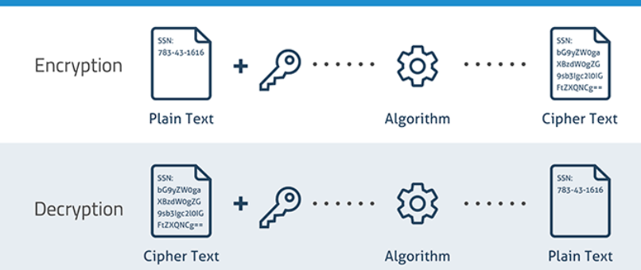
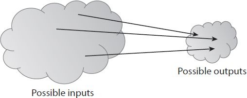

# Housekeeping

## Time and venue

Three sessions: 15:15 -- 16:10, 16:25 -- 17:20, 17:35 -- 18:30

Tuesdays, on Zoom, https://epfl.zoom.us/j/4897861984

## Preliminary agenda 

(@) 2020-09-15: Blockchain fundamentals

(@) 2020-09-22: Case study, On-, cross- and off-chain activities

(@) 2020-09-29: Smart contract with Ethereum, hands-on session

(@) 2020-10-06: Research seminar
    - **Andreas Richardson** (Imperial College London): Carbon Trading with Blockchain
    - **Juan Ignacio Ibañez** (Catholic University of Cordoba): Accounting with Blockchain
    - **Simon Sive** (UCL): Real estate tokenization

(@) 2020-10-13: Industry seminar
    - **Adrien Treccani** ([Metaco](https://www.metaco.com/))
    - **Ilya Volkov** ([YouHodler](https://www.youhodler.com/))
    - **Gaspard Peduzzi** ([APWine](https://apwine.fi/))

(@) 2020-10-20: Group presentation

## Lessons learned from previous year {.plain}

{width=80%}

---

## Assessment methods

- 75% Group essay
- 25% Group presentation
- *Bonus* In-class and take-home assignments

---

### It is not just any group project ...

---

## Previous students' work

- **Matthieu Baud**, **Henry Decléty**, **Hugo Roussel**: *Jack the Rippler* won [Ripple's Block-Sprint Hackathon](https://actu.epfl.ch/news/fast-as-lightning-prize-of-the-block-sprint-hack-2/) (GBP 3,000 award) 
- **Andreas Richardson**: *Carbon Trading with Blockchain* presented at the [International Conference on
Mathematical Research for Blockchain Economy](https://www.marble-conference.org/marble2020-programme), to be pulished by [Springer](https://www.springer.com/gp/book/9783030533557)
- **Yanan Liu**: *Libra's impact on world economy* published on the [Medium Channel of UCL Centre for Blockchain Technologies (CBT)](https://medium.com/uclcbt/inception-of-stablecoins-like-libra-and-its-impact-on-world-economy-73d9124f25a6)
- **Lucas Froissart**, **Ana Frei**: *EUREKAsh* received the highest score of the class

# Definition of blcockchian

### What is blockchain? (How do you understand blockchain)

---

[IBM and Oliver Wyman:](https://www.ibm.com/blockchain/what-is-blockchain)

> Blockchain is a shared, distributed ledger that facilitates the process of recording transactions and tracking assets in a business network. 
An asset can be tangible --- a house, a car, cash, land --- or intangible like intellectual property, such as patents, copyrights, or branding. 
Virtually anything of value can be tracked and traded on a blockchain network, reducing risk and cutting costs for all involved.

---

[Wikipedia:](https://en.wikipedia.org/wiki/Blockchain)

> A blockchain, originally block chain, is a growing list of records, called blocks, that are linked using cryptography. Each block contains a cryptographic hash of the previous block, a timestamp, and transaction data (generally represented as a Merkle tree).

---

[Oxford:](https://www.lexico.com/en/definition/blockchain)

> a system in which a record of transactions made in bitcoin or another cryptocurrency is maintained across several computers that are linked in a peer-to-peer network

---

### What defines "blockchain"?

---

:::::: {.columns}
::: {.column width="33%"}
#### Properties
- Trustless?
- Distributed?
- Decentralized?
- Peer-to-peer?
- Tamper-proof?
:::

::: {.column width="33%"}
#### Components
- Cryptographic hash?
- Timestamp?
- Block?
- Chain?
:::

::: {.column width="33%"}
#### Purpose
- Record transactions?
:::
::::::

# Bitcoin: A Peer-to-Peer Electronic Cash System [@Nakamoto]

---

### What problem(s) does a blockchain solve?

---

## De/centralization

### Why was there centralization in the first place?

---

#### Centralization of payment system

- 1990s, standards for protocol-level encryption just emerged
- Lack of trust
    - Security
    - Privacy
- Birth of the intermediary architecture

#### Centralization of monetary system

- "Fiat" currency: trust in the government
    - IOU from a bank vs IOU from a stranger
    - Gold standard: 1 oz gold = 35 USD

**It made things easier --- because you only have to trust one entity.**

---

### Is a central authority still *necessary* today?

---

*Possibility* to abandon central authority

- Security mechanisms advanced
- Payment scheme was lagging behind

---

### But can we just leave it?

---

Necessity [?] to abandon central authority

#### Monetary system

- Abandonment of the gold standard
- Capital control
- Hyperinflation: Zimbabwe
- Financial crisis
    -The Times 2009-01-03: [Chancellor on Brink of Second Bailout for Banks](https://www.thetimes03jan2009.com/)
    - New York Times 2020-04-09: [With $2.3 Trillion Injection, Fed’s Plan Far Exceeds Its 2008 Rescue](https://www.nytimes.com/2020/04/09/business/economy/fed-economic-rescue-coronavirus.html)

#### Payment system

- Privacy

---

### What problem does a blockchain cause?

---

## Latency

### Double spending

Double spending is a problem native to a distributed network due to latency, but less problematic in a centralized one.

### Detecting double spending

Imagine:

- You have $100 in your bank account
- You issue to merchants A and B *each* a $100 check 

What will happen?

---

<!-- ### Preventing double spending (and solving anonymity) in a centralized system -->

<!-- Problem 1: Security -->

<!-- Solution: Payer (digitally) signs the check with a *unique serial number* -->

<!-- --- -->

<!-- Problem 2: Privacy --- payer can record the serial number and track where the note is spent  -->

<!-- Best way for two people to share a cake? -->

<!-- --- -->

<!-- Solution: -->

<!-- - Payee issues a unique serial number and (digitally) hide it -->
<!-- - Payer signs the transaction without seeing the serial number (blind signature) -->

<!-- --- -->

<!-- We need to connect to a central authority (e.g. a bank) who checks the serial numbers! -->

<!-- --- -->

### Preventing double spending in a centralized system

Law enforcement: You'll be punished if you double spend.

## Transparency -> Privacy issues

### No real ID needed -- only a BTC address

Does pseudonymity suffice for privacy protection?

---

### UTXO (Unspent transaction output)

---

: input -> output](figure/UTXO0.png)

:  input 1 + input 2 -> output](figure/UTXO1.png)

:  input -> output 1 + output 2](figure/UTXO2.png)

## Sorting

### Time-stamping with a paper-based ledger

- Transactions entered one after another in the notebook, with no pages left blank
- The notebook is then reviewed and stamped on a regular basis by a notary public

---

### Now the order of transactions are guaranteed, what about the content of transactions?

---

### Haber and Stornetta's scheme

Time-stamp the data itself! [@Harber1991]

---

### Why using *blocks*?

- Haber and Stornetta's  original idea was to link documents individually, but changed that into a hybrid method of linking blocks in order to *decrease the time of verifying*.
- Bitcoin uses multiple transactions in the same block as an optimization.

**Trade off between verification and speed.**

---

### Digital Signature

Requirement

1. Unforgeability: Only you can make it

2. Verifiability: Everybody else can easily verify it

---

### Scheme

***Signer:***

Generate key pairs: private (secret) key and public key. $generateKeys$ is a random function!

$$generateKeys:\ keysize \rightarrow (sk, pk)$$

Sign the message:

$$sign:\ (sk, message) \rightarrow sig$$

---

***Verifier:***

The message gets verified:

$$verify:\ (pk, message, sig) \rightarrow isValid$$

*Note:*

$$verify(pk, message, sign(sk, message)) == True$$

<!-- --- -->

<!-- {width=90%} -->

---

### What if somebody else gets the same key as me? 

---

The probability of getting the same 256-key is very small so that we don't have to worry about it. 

Crucial: Random algorithm used to generate those keys have to be "random", not predictable!

---

## Unforgeability game:

***Attacker:***

1. Sees the public key $pk*$ (but not the private key $sk*$), and also functions $generateKeys$, $sign$ and $verify$
2. Many messages/documents $\{m1, m2, m3, ...\}$ of his choice and corresponding $\{sig1, sig2, sig3, ...\}$
    - Many: a plausible number, e.g. polynomial function of the key size
3. Now try to sign a new given message $M$ by producing $sig'$

***Verifier:***

- run $verify(pk*, M, sig')$

---

A signature scheme is unforgeable iff, no matter what algorithm the attacker uses, his chance of successfully forging a message is extremely small.

##### Bitcoin uses:

Elliptic Curve Digital Signature Algorithm (ECDSA)

# Cryptographic hash functions

## Hash function

- Input: any string of any size.
- Output: fixed-sized (256-bit)
- Efficiently computable

To be cryptographically secure, a hash function must have the following 3 properties:

- collision resistance
- hiding
- puzzle friendliness

---

### Collision resistance

A hash function $H$ is said to be collision resistant if it is **infeasible** to find two values, $x$ and $y$, such that $x \neq y$, yet $H(x) = H(y)$.

{ width=90% }

---

A lame (not cryptographically secure) hash function:

$$H(x)= x \mod 2^{256}$$

---

### Hiding

A hash function $H()$ is said to be hiding if when a secret value $r$ is chosen from a probability distribution that has high **min-entropy**, then, given $H(r \| x)$, it is infeasible to find $x$.

where $\|$ is a concatenation operator.

$$
\mathcal{H}_{\min (G)} = \overbrace{
	\min_{a \in Range(G)} \underbrace{\log_2 \left(\frac{1}{\mathbb{P}[a]} \right)}_{
		\text{\# bits to encode password } x
}}^{
	\text{\# bits to encode most likely password } x
}
$$

*Note: $r$ can be our serial number!*

---

### Puzzle friendliness

A hash function $H$ is said to be puzzle friendly if for every possible $n$-bit output value $y$, if $k$ is chosen from a distribution with high min-entropy, then it is infeasible to find x such that $H(k \| x) = y$ in time significantly less than $2^n$.

{ width=90% }

#### Bitcoin uses:

SHA-256 (Secure Hash Algorithm 256)

---

## Distributed consensus protocol

- $n$ nodes that each has an input value. 
- Some of these nodes are faulty or malicious. 
- A distributed consensus protocol has the following two properties
    1. It must terminate with all honest nodes in agreement on the value. 
    2. The value must have been generated by an honest node.

---

The majority rule?

---

## Sybil attack

Attacker copies of nodes that a malicious (enabled by pseudonymity)

# Bitcoin consensus algorithm (simplified)

## Proof-of-Work

1. New transactions are broadcast to all nodes. 
2. Each node collects new transactions into a block. 
3. In each round, a random node gets to broadcast its block. 
    - random: not selected, but through competition (**work**)
4. Other nodes accept the block only if all transactions in it are valid (unspent, valid signatures).
5. Nodes express their acceptance of the block by including its hash in the next block they create.

---

### What do miners compete to solve?
