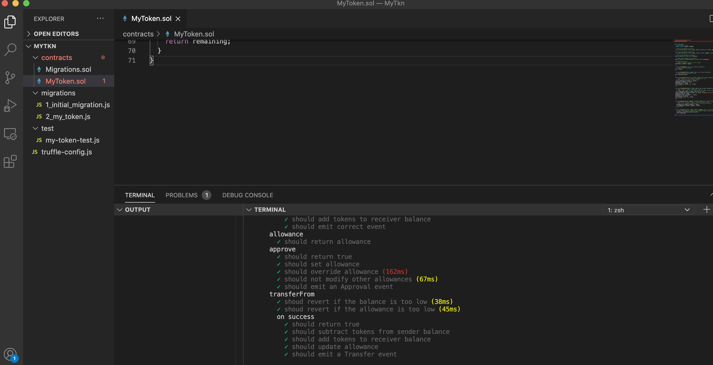

# Programming hands-on [@Perez2019a]

## Solidity

* High-level language targeting the EVM
* Looks vaguely like JavaScript
* Strongly typed, with a fairly simple type-system
* Contains smart contract related primitives
* Supports multiple inheritance


## Compiling Smart Contracts: types

* EVM only has 256 bit words
* Solidity has a simple type system including
  * integer types
  * data structures (lists, maps)
* Integer types are encoded using bitwise operations  
  e.g. `uint8`: `uint256 & 0xff`
* Data structures are encoded using hash  
  e.g. `key(list[5]) = keccak256(index(list) . 5)`

## Smart Contract implementing a simple coin {.shrink}

```solidity
contract Coin {
  address public minter;
  // "mapping" creates "balances" as state variable
  // "public" makes variables accessible from other contracts
  mapping (address => uint) public balances;

  // constructor (optional) is only run when the contract is created
  constructor() public {minter = msg.sender;}

  function mint(address receiver, uint amount) public {
    require(msg.sender == minter);
    require(amount < 1e60);
    balances[receiver] += amount;
  }

  function send(address receiver, uint amount) public {
    require(amount <= balances[msg.sender]);
    balances[msg.sender] -= amount;
    balances[receiver] += amount;
  }
}
```


## Ecosystem Overview

* Solc: Solidity compiler
* Truffle: Framework to help build/test
* Ganache: Easy setup of local private chain 
* Mythril, Securify, etc: Static analysis tools


## Installing software

### NodeJS (if not already installed)

Follow instructions at: https://nodejs.org/en/download/

### Truffle

```
npm install -g truffle
```

## What we will build

A simple token compliant with the [ERC-20 standard](https://eips.ethereum.org/EIPS/eip-20)

This is how most "coins" or "tokens" are implemented on Ethereum.
It defines a common interface to

* Transfer tokens
* Allow other parties to transfer tokens
  * need nested mapping 
  ```solidity
  mapping (
      address => mapping(address => uint)
  ) public allowances;
  allowances[_owner][_spender]
  ```
* Check balance for tokens
* Emit events for token transfers and allowance approvals
  * `emit` creates event logs

## ERC-20 interface {.shrink}

```solidity
// Returns the total supply of tokens
// `view` promises NOT to modify state
// `returns` declares output parameter (default: 0)
function totalSupply() public view returns (uint256)

// Returns the balance of `_owner`
function balanceOf(address _owner) public view returns (uint256 balance)

// Transfers `_value` from sender to `_to`
function transfer(address _to, uint256 _value) public returns (bool success)

// Transfers `_value` from `_from` to `_to` if `_from` authorized the send
function transferFrom(address _from, address _to, 
                      uint256 _value) public returns (bool success)

// Approves `_spender` to spend `_value` on behalf of the sender
function approve(address _spender, uint256 _value) public returns (bool success)

// Returns how much `_spender` is allowed to spend on behalf of `_owner`
function allowance(address _owner, 
                   address _spender) public view returns (uint256 remaining)

// Is emitted when `_from` transfers `_value` to `_to`
event Transfer(address indexed _from, address indexed _to, uint256 _value)
// Is emitted when `_owner` allows `_spender` to spend `_value` on his behalf
event Approval(address indexed _owner, address indexed _spender, uint256 _value)
```

## Token specifics

We will build a very simple token:

* Fixed total supply (1,000,000 for the sake of example)
  * No tokens can be created or burned after creation
* All tokens belong to owner at contract creation time
* No other particular limitation

## Starting to develop {.shrink}

An IDE supporting solidity syntax highlighting is recommended (e.g. Visual Studio Code)

- Download the working folder: 
https://1drv.ms/u/s!AmpQRJqgxh5Yj4gJYQulJPeIQB8tbQ
- Open `/MyTkn/contracts/MyToken.sol` with your IDE or text editor
- Run the tests regularly under `MyTkn`

```zsh
truffle test
```
----


## Solution {.shrink}
(try not to peek)

https://github.com/xujiahuayz/BlockchainCourse/blob/master/my-token/contracts/MyToken.sol


The contract has been deployed on Kovan testnet:

https://kovan.etherscan.io/address/0x714adeedb372ce1307d69cca1dfc694a4ec587ed#code

----



<!-- ### Start a new project -->

<!-- ```zsh -->
<!-- mkdir my-token -->
<!-- cd my-token -->
<!-- truffle init -->
<!-- ``` -->

<!-- ### Create migration file:  -->

<!-- ```zsh -->
<!-- vi migrations/2_my_token.js -->
<!-- ``` -->

<!-- ### Copy the following code into `2_my_token.js` -->

<!-- ```javascript -->
<!-- const MyToken = artifacts.require("MyToken"); -->

<!-- module.exports = function(deployer) { -->
<!--   deployer.deploy(MyToken); -->
<!-- }; -->
<!-- ``` -->

<!-- ###  Download the specs for the project -->

<!-- ```zsh -->
<!-- wget https://git.io/JTkZq -O test/my-token-test.js -->
<!-- ``` -->

<!-- ## Implement and test the project {.shrink} -->


<!-- ### Get the contract skeleton (optional)   -->

<!-- ```zsh -->
<!-- wget https://git.io/JTkZL -O contracts/MyToken.sol -->
<!-- ``` -->

<!-- ### Or if you feel confident, create a blank `MyToken.sol` in the `contracts` folder -->

<!-- ```zsh -->
<!-- truffle create contract MyToken -->
<!-- ``` -->

<!-- ### Run the tests -->

<!-- ```zsh -->
<!-- truffle test -->
<!-- ``` -->
